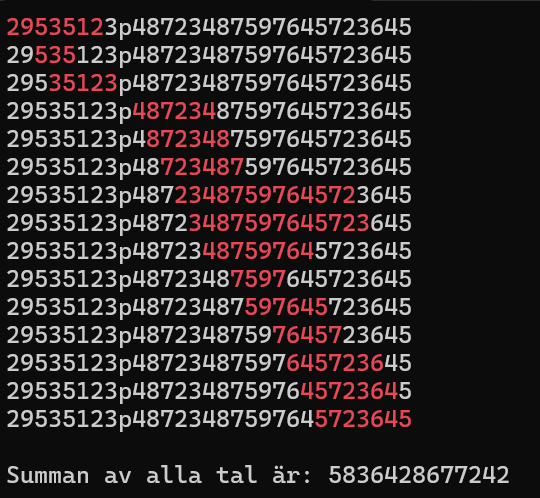

# Labb 1 - Algoritmer

Det här är en konsollapplikation där användaren skriver in en text av datatypen sträng i konsollen. Den inmatade strängen ska sedan sökas igenom efter alla delsträngar som är tal som börjar och slutar på samma siffra, utan att start/slutsiffran, eller något annat tecken än siffror förekommer där emellan. För varje sådan delsträng som matchar kriteriet ovan ska programmet skriva ut en rad med hela strängen, men där delsträngen är markerad i en annan färg. Programmet ska också addera ihop alla tal den hittat enligt ovan och skriva ut det sist i programmet.

## Exempel på output för input ”29535123p48723487597645723645”:

